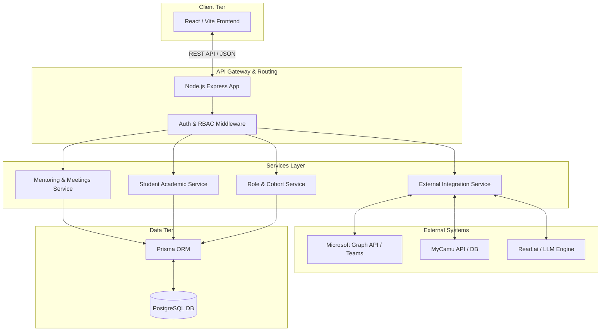

# High-Level System Design (HLSD) for MMRMS

## 1. System Overview
The Mentor-Mentee Relationship Management System (MMRMS) is designed to streamline academic mentoring, tracking, and communication. Given the frequently changing business requirements, the architecture is built to be highly modular, ensuring that adding new integrations (like MS Teams, MyCamu) or altering role structures requires minimal refactoring.

## 2. High-Level Architecture Diagram

## 3. Core Components
- **Client Tier**: A React Single Page Application (SPA) providing role-based dashboards (Student, Mentor, Year Coordinator, HOD). It uses modular UI components that adapt based on the user's role.
- **API Tier**: A Node.js Express server acting as the central hub. It validates requests, enforces role-based access control (RBAC), and routes to the appropriate business service.
- **Service Layer**: Decoupled business logic modules. By isolating domains (e.g., Academics vs. Meetings), changing the rules for one doesn't break the other.
- **Data Tier**: Relational data management using PostgreSQL, accessed via Prisma ORM for type-safe database queries and easy schema migrations.

## 4. Flexible Design Patterns for Changing Requirements

To handle changing requirements effortlessly, the following architectural patterns are enforced:

### A. Strategy Pattern (For Integrations)
Since data sources (like MyCamu for attendance or Teams/Read.ai for meetings) might change or expand, we will use the Strategy Pattern. 
- **How it works:** Instead of hardcoding MyCamu API calls directly into the Student service, we create an `AttendanceProvider` interface. The MyCamu integration is just one strategy. If the college switches ERPs, we just write a new strategy class without touching the core system.

### B. Role-Based Access Control (RBAC) with Middleware
Roles are shifting (e.g., updating Class Advisor to Year Coordinator and adding HOD). 
- **How it works:** Permissions are not hardcoded into UI views or database queries. Instead, a middleware checks the JWT payload. We define abilities (e.g., `CAN_VIEW_ALL_STUDENTS`) and map roles to these abilities. If a new role is added, we just map it to the existing abilities.

### C. Webhooks & Event-Driven Updates
For automation like Read.ai filling meeting minutes, synchronous API calls are too slow and brittle.
- **How it works:** The system exposes secure Webhook endpoints. When a Teams meeting finishes, Teams/Read.ai pushes a payload to our webhook. An event listener processes the transcript in the background and populates the draft meeting record, notifying the mentor when it's ready.

### D. Multi-Tenancy via Cohort Partitioning
To handle batch separation (e.g., 24BCS vs 25BCS) automatically:
- **How it works:** Data queries will enforce a "Cohort ID" derived from the student's roll number. This ensures that when querying active students, alumni (older batches) are naturally filtered out without needing complex archiving scripts.
